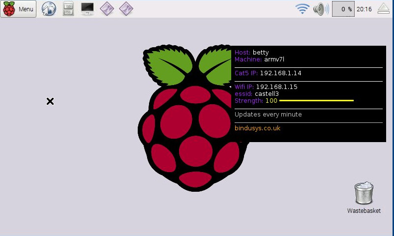

BinduSYS rpi setup 
=================================

A small collection of scripts to setup an rpi. 
- Removes games and other non dev stuff (see [apt/remove.txt](apt/remove.txt))
- Installs pyqt5 and others (see [apt/install.txt](apt/install.txt))

Note: 

- the "default" user is `pi`
- the default password is is a `raspberry`


## 1: Install git and clone this repos

Kick up a terminal and tap in

```
sudo apt-get install git
git clone https://github.com/bindusys/bindu-pi.git
```

## 2: Install fabric and initial setup

Enter the bindu-sys dir and run the script "initial-setup.sh"
which install some python headers and fabric

```
cd bindu-sys
./initial-setup.sh
```

## 3: Run `fab` commands

To complete tap in `fab all` which executes a series of commands
to remove/add/upgrade and could take a while. Will complete with a reboot.

```
fab all
```

Optionally, install "conky", which will
create an overlay with the machine's ip address etc 
(useful when no keyboard and require remote access)



```
fab install_conky
```


For more "fab commands" run `fab -l`

### 4: Setup ssh


SSH in from remote machine with
```
    ssh pi@<ip>
    > pass = raspberry
```
To set passwordless login
```
    ssh-copy-id pi@<ip>
```
then below should work with no pass
```
    ssh pi@<ip>
```
 
 
### 5: Start VNC server

There are two scripts in tools/ directory.

- `vnc-desktop-start.sh` start a normal screen session
- `vnc-touch-start.sh` start an tip-touchcreen sized screen session


Have Fun! :-)


